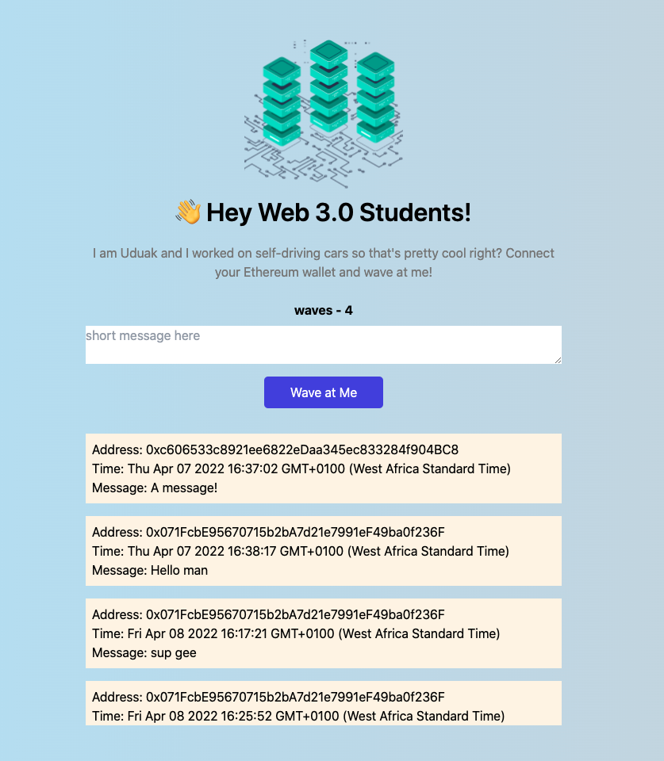

# WavePortal

WavePortal is place where anyone on the internet can learn a little about who you are and send you a 👋 + a message and have that data saved on the blockchain through an Ethereum smart contract. (A smart contract is basically code that lives on the blockchain you can read and write from, we'll talk about this more in a bit).



## Getting Started

First, run the development server:

```bash
cd client
# or
yarn dev
```

## Getting Started

To get a local copy up and running follow these simple example steps.

### Prerequisites

Make sure Node.js is running on your local machine

### Setup

~~~bash
$ git clone git@github.com:acushlakoncept/waveportal.git
$ cd waveportal
~~~

Install modules:

```
yarn add 
```

Setup your API Key for Auth0

- Follow the steps [here](https://auth0.com/docs/quickstart/webapp/nextjs/01-login) to setup your app
- Locate the file `.env.local.example` in your root directory, remove the .example leaving you with `.env.local`
- You can find the corresponding fields from your Auth0 dashboard

### Usage

Start server with:

```
  npm run dev
```

# Authors

👤 **Uduak Essien**

- Github: [@acushlakoncept](https://github.com/acushlakoncept/)
- Twitter: [@acushlakoncept](https://twitter.com/acushlakoncept)
- Linkedin: [acushlakoncept](https://www.linkedin.com/in/acushlakoncept/)

## 🤝 Contributing

Contributions, issues and feature requests are welcome!

Feel free to check the [issues page](issues/).

## Show your support

Give a ⭐️ if you like this project!

## Acknowledgments
- [Buildspace](https://app.buildspace.so/)